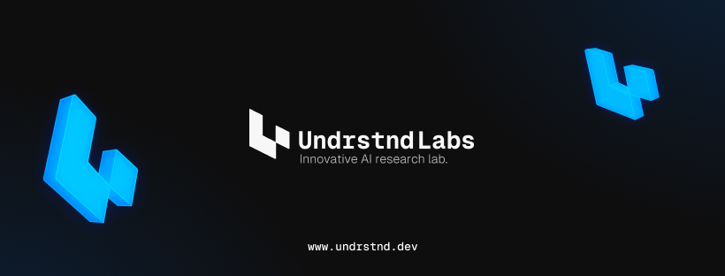

	<h1 align="center"><b>Undrstnd Developers</b></h1>
    

        Easy, cheap and fast AI integration for devs.
         
         
        <a href="https://go.undrstnd.dev/dc">Discord</a>
        ·
        <a href="https://dev.undrstnd.com">Website</a>
        .
        <a href="https://go.undrstnd.dev/li">LinkedIn</a>
        .
        <a href="https://go.undrstnd.dev/fb">Facebook</a>
        .
        <a href="https://github.com/undrstnd-labs/developers/issues">Issues</a>
    

## Under active development

> Undrstnd Developers is dedicated to delivering a high-quality product and has been actively improving code quality and best practices. Our philosophy centers around providing a seamless and enjoyable user experience, with a focus on reliability, efficiency, and security. We're excited about the progress made and continue to innovate and improve the platform for our users.

## App Architecture

- PNpm
- React
- TypeScript
- Nextjs
- TailwindCSS
- Shadcn
- Prisma
- OpenAI

### Hosting

- Neon (Database)
- Supabase (Storage, realtime)
- Vercel (Website, edge-config, analytics and metrics)
- Github (Codebase, issues, PRs, actions)

### Services

- Clerk (Authentication)
- Sentry (Error tracking)
- Arcjet (Security)
- BetterStack (Logging)
- PostHog (Analytics)
- Google Analytics (Analytics)
- Github Actions (CI/CD)
- Trigger.dev (Background jobs)
- Stripe (Payments)
- Dub (Short URLs)
- Resend (Email)
- Vercel AI SDK (AI)

## Repo Activity

